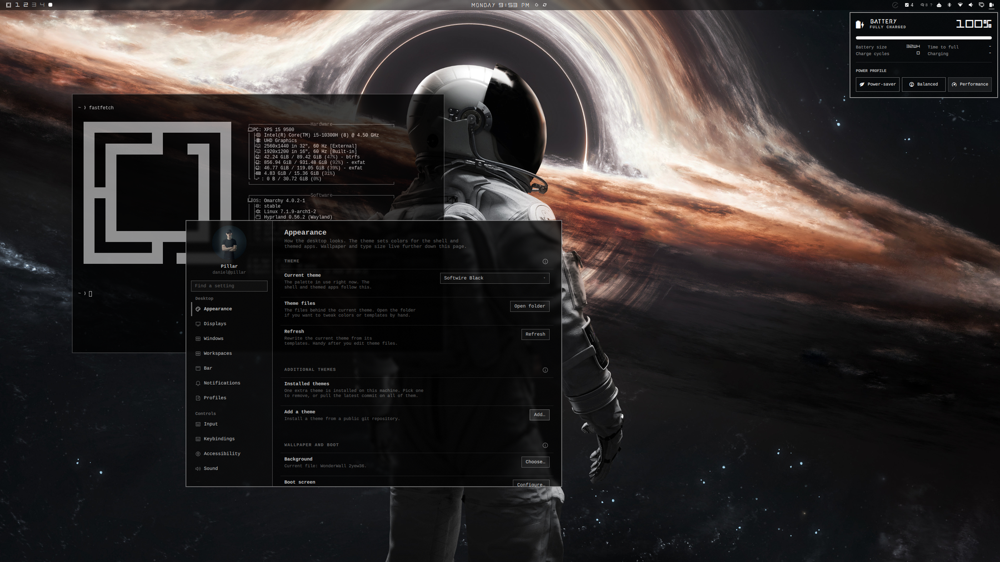
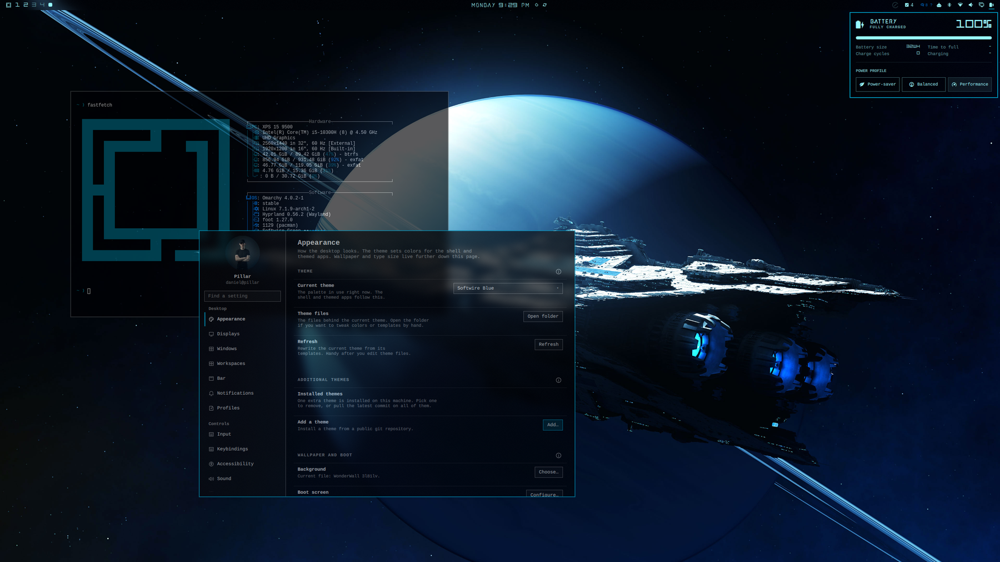
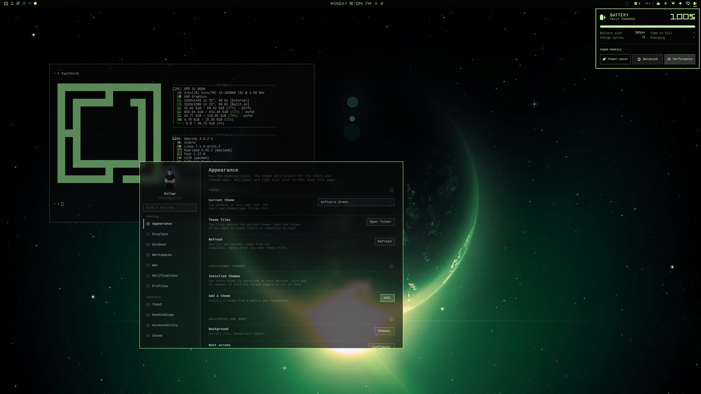
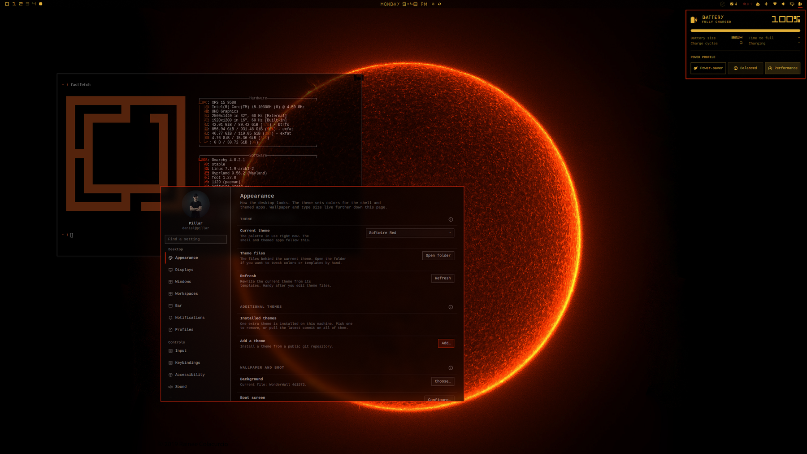
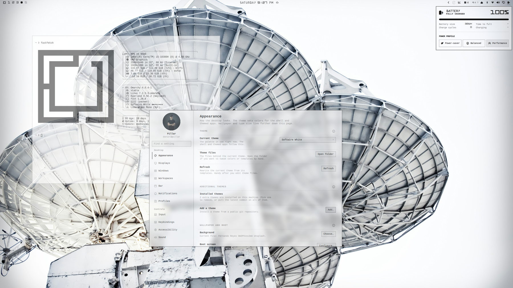

# Softwire

[](https://github.com/tcballard/omarchy-badges)

A five-theme pack for [Omarchy](https://omarchy.org/): Softwire Black, Softwire Blue, Softwire Green, Softwire Red, and Softwire White. Same type, icons, and layout — each with its own palette, default wallpaper, and cover.

## Install

One command installs all five:

```bash
curl -fsSL https://raw.githubusercontent.com/Pillartheman1/omarchy-softwire-themes/main/install.sh | bash
```

Or clone and run the same script locally:

```bash
git clone https://github.com/Pillartheman1/omarchy-softwire-themes.git
cd omarchy-softwire-themes
./install.sh
```

Do not use `omarchy theme install` on this repository. That command clones a single theme; this pack is five themes and needs `install.sh`.

Remove all five the same way:

```bash
curl -fsSL https://raw.githubusercontent.com/Pillartheman1/omarchy-softwire-themes/main/uninstall.sh | bash
```

Or `./uninstall.sh` from a clone. If a Softwire theme is active, the script switches to Catppuccin first so the desktop is not left on a deleted theme.

Then pick one:

```bash
omarchy theme set "Softwire Black"
omarchy theme set "Softwire Blue"
omarchy theme set "Softwire Green"
omarchy theme set "Softwire Red"
omarchy theme set "Softwire White"
```

## Themes

### Softwire Black



Monochrome Softwire. Neutral greys, white chrome, astronaut default wallpaper.

### Softwire Blue



Cyan bar and menus, light grey application text, spaceship default wallpaper.

### Softwire Green



Lime bar and menus, green-planet default wallpaper.

### Softwire Red



Gold bar and menus, red accent, sun default wallpaper.

### Softwire White



Light-mode Softwire. Pale field, grey chrome, dark type.

## Notes

- Glass is part of each theme: 50% shell surfaces (bar, menus, notifications) plus blurred window opacity (75% on Black, 65% on Blue / Green / Red, 80% on White).
- Fonts: Andromeda (title) is freeware, non-commercial. Y224 (numbers) is CC0.
- Wallpapers are included with each theme. Cycle extras with `omarchy theme bg next`.
- Updating: run the install command again. If you are already on a Softwire theme, the script re-applies it.

## License

Theme configuration is MIT. Bundled fonts and wallpapers keep their original licenses.
